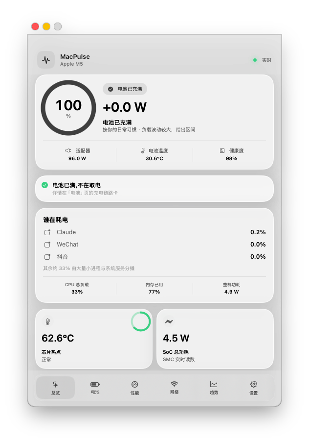
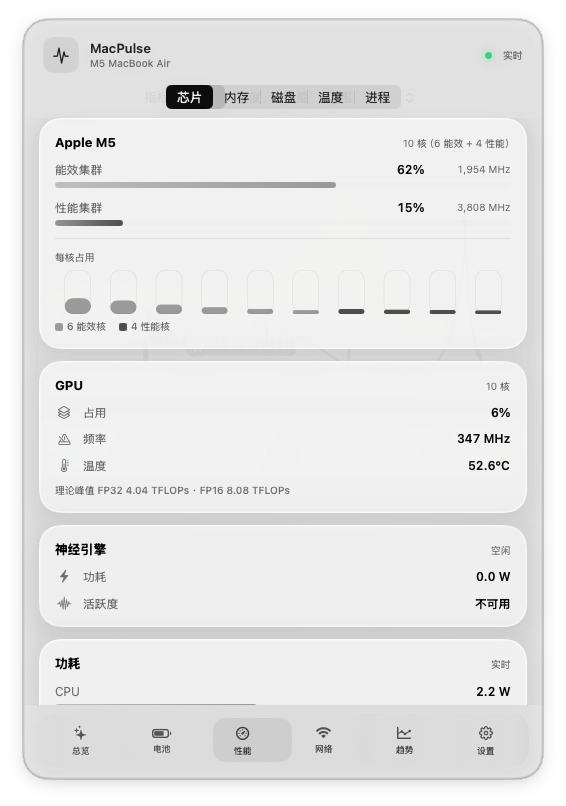

# MacPulse

**Honest, native performance monitoring for Apple Silicon Macs.** A menu-bar glass panel that shows power, thermals, battery, processes, disk and network — and never fakes a number: anything unreadable says so, instead of rendering a fabricated zero. UI in English and Simplified Chinese, following the system language.

MacPulse 是一款针对 Apple Silicon Mac 的原生菜单栏监控 App。充放电功率、电池健康、芯片温度、CPU/GPU 功耗轨、进程排行、磁盘与网络吞吐,集中在一块透出桌面的玻璃面板里。它的立身之本是**诚实**:读不到的显示「不可用」,绝不编数据;每个关键读数都有独立真值对账测试盯着。

| 总览 | 性能 |
|---|---|
|  |  |

> **状态:3.0.0-beta.3。** 目前只在一台 M5 MacBook Air 上完整实测过;跨机型行为(M1–M4、
> 带风扇机型)按上游语料与优雅降级设计推断。装好后打开「设置 → 本机传感器覆盖」,
> 一眼看清你机器上每类数据源的可用情况——报 issue 时请附上这张卡的内容。

## 功能

- **玻璃仪表界面**:面板透出桌面墙纸(behindWindow 材质),全单色墨阶设计,
  颜色只在「好 / 注意 / 出事」三种语义时出现(规范见 `docs/design-system.md`)
- **充电链路诊断**:充电器 → 线缆(e-marker)→ 协商结果全链,一句话点名充电慢的瓶颈
- **原生传感器**:IOReport 能耗/频率/占用 + SMC 温度/整机功率,无捆绑二进制、
  无 root、无 entitlement;集群频率按状态名档位精确对表
- 菜单栏自选指标组合(净功率/热点温度/电量/SoC 功耗/内存),三种显示密度
- 按 App 合并的 CPU、内存、磁盘、GPU、能耗排行,可展开后台子进程;含自身负担明细
- 磁盘卷容量(含「可自动腾出」)、开机累计读写、存储温度
- 蓝牙外设电量(AirPods 左/右/盒分开报)
- 网络实测(明确同意制)与本机链路读数,趋势 90 天
- 最近 7 天历史趋势(分钟聚合,睡眠与缺失不会伪造成零)
- 高温/热压力/健康度本地提醒:独立开关、冷却时间、明确授权
- 界面中英双语,跟随系统语言(英文系统自动显示英文)
- 无充电控制、无风扇控制;唯一的网络请求是用户明确开启的测速

## 安装

要求:Apple Silicon Mac · macOS 26.0+

到 [Releases](https://github.com/wei666-china/MacPulse/releases) 下载最新的
`MacPulse-*.zip`,解压后把 `MacPulse.app` 移入「应用程序」,**右键 → 打开**
——ad-hoc 签名首次必须这样开,直接双击会被 Gatekeeper 拦下。

下载完整性校验(每版 Release 页都附了 SHA-256):

```sh
shasum -a 256 MacPulse-3.0.0-beta.3.zip
```

首次启动会显示独立仪表盘窗口;关掉后 App 常驻菜单栏,点菜单栏图标弹出玻璃面板,
再次双击 `MacPulse.app` 可重开独立窗口。

## 本地构建

额外要求:Xcode 26.0+

```sh
./build-app.sh release
```

产物在 `outputs/`:把 `MacPulse.app` 移入 `/Applications` 双击打开。本地构建使用
ad-hoc 签名,不需要付费开发者账号。也可以直接在 Xcode 打开 `Package.swift`。

## 架构

- `MacPulse` — SwiftUI 界面、SwiftData 历史、提醒;菜单栏项与玻璃浮窗为自建
  NSStatusItem + NSPanel(每一层透明度可控)
- `MacPulseSensors` — 原生传感器库:IOReport(dlsym 运行时绑定)+ SMC +
  pmgr 频率表 + 网络/磁盘速率。读取思路改编自 mactop 与 Stats(均 MIT)
- `MacPulseCollector` — 独立采集进程,输出 `schemaVersion: 2` 容错 NDJSON;
  无文档接口崩溃只影响采集器,不拖垮 App
- `MacPulseCore` — 纯 Foundation 值类型与算法,全部可离线单测

工程铁律(贡献前请读):

1. **绝不编数据** —— 读不到 = 「不可用」,机型不支持 = 「本机型不提供」,永不显示假 0
2. **真值对账** —— 新读数必须配独立工具对拍测试(ioreg/df/iostat/vm_stat…),不许自己对自己
3. **出门检查** —— 推送前跑 `./Tools/preflight.sh`:本地化三查 + 编译 + 全量测试,
   三项全过才能推。装了 pre-push 钩子(`git config core.hooksPath Tools/githooks`)
   它会自己跑
4. **设计规范** —— `docs/design-system.md` 三条铁律 + 复审清单,UI 改动逐条过

## 隐私

除网络测速外,MacPulse 不发送任何网络请求。

网络测速首次使用需要明确同意,在此之前不发出任何请求。开启后只连接
`speed.cloudflare.com`(测速数据,无意义填充字节)与 `captive.apple.com`
(苹果官方连通性检测,一个轻量请求);不发送设备信息、进程名、
电池数据或任何标识符。测速结果只写入本机,不含 IP、Wi-Fi 名称或精确位置;
区分不同地点用加盐哈希,盐只存在本机。实测流量:轻量约 35 KB、节省流量约 20 MB、
标准约 78 MB;按流量计费与低数据模式下永不自动完整测速。Wi-Fi 只读协商速率与
PHY 模式,不读 SSID 与信号强度,因此不需要定位权限。

历史数据存于 `~/Library/Application Support/MacPulse/`。

## 致谢 / Acknowledgements

MacPulse 的几块核心读取能力,是在这些开源项目里学到的。点名致谢,逐项说明学了什么:

| 项目 | 作者 | 我们学习/改编了什么 | 许可 |
|---|---|---|---|
| [mactop](https://github.com/metaspartan/mactop) | Carsen Klock | IOReport 能耗模型与集群频率的原生读取思路(dlsym 绑定、通道订阅、Δ能量→瓦特) | MIT |
| [Stats](https://github.com/exelban/stats) | Serhiy Mytrovtsiy | AppleSMC 用户客户端的结构体布局、选择子与 sp78/flt/fpe2 类型解码 | MIT |
| [WhatCable](https://github.com/darrylmorley/whatcable) | Darryl Morley | USB-C 充电口与线缆 e-marker 的 PD 位解码,以及充电瓶颈判定思路 | MIT |

MacPulse's core reading techniques were learned from these projects — named here with exactly
what was adapted, because that's what respect for other people's work looks like. Full license
texts: [THIRD_PARTY_NOTICES.md](THIRD_PARTY_NOTICES.md). The same acknowledgements are shown
inside the app (Settings → Acknowledgements).

注:Stats 的 HID 温度传感器路径源自 GPL 血统的 MenuMeters,MacPulse **没有**采用那部分——
只改编了其 MIT 许可范围内的 SMC 实现。

## License

MIT — 见 [LICENSE](LICENSE)。
